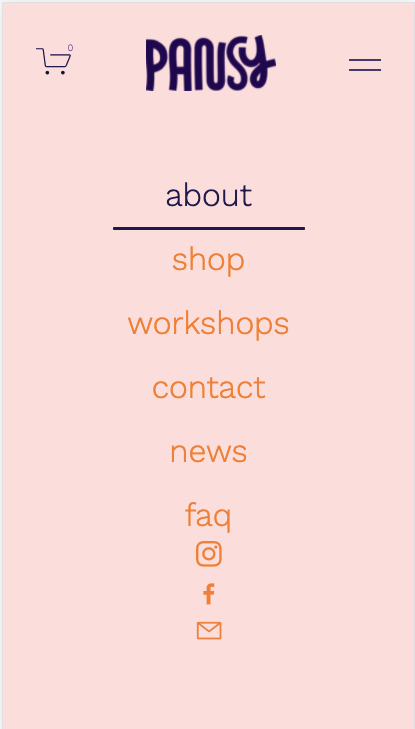
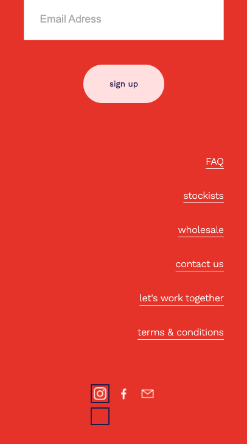

# Procesverslag
Markdown is een simpele manier om HTML te schrijven.  
Markdown cheat cheet: [Hulp bij het schrijven van Markdown](https://github.com/adam-p/markdown-here/wiki/Markdown-Cheatsheet).

Nb. De standaardstructuur en de spartaanse opmaak van de README.md zijn helemaal prima. Het gaat om de inhoud van je procesverslag. Besteedt de tijd voor pracht en praal aan je website.

Nb. Door *open* toe te voegen aan een *details* element kun je deze standaard open zetten. Fijn om dat steeds voor de relevante stuk(ken) te doen.

## Jij

uitwerken voor kick-off werkgroep

### Auteur:
Roos Horselenberg

#### Je startniveau:
blauw

#### Je focus:
surface plane
 

## Je website

uitwerken voor kick-off werkgroep

### Je opdracht:
pansy-shop.com

#### Screenshot(s) van de eerste pagina (small screen): 
De startpagina: screenshot wil helaas niet goed werken.

#### Screenshot(s) van de tweede pagina (small screen):
About me: screenshot wil helaas niet goed werken.

 

## Breakdownschets (week 1)

uitwerken na afloop 2e werkgroep

### de hele pagina: 

### dynamisch deel (bijv menu): 

## Voortgang 1 (week 2)

uitwerken voor 1e voortgang

### Stand van zaken
Problemen die ik heb:
- De werking van de site op telefoon formaat;

- Probleem centreren elementen;

### Agenda voor meeting
samen met je groepje opstellen

Roos:
- Hulp met het schalen op mobiel formaat.

Mina:
- Hulp met schalen.

Valerie:
- Hulp met centreren.
- Wat moet er in de footer?

Merel:
- Nog wat problemen met css.

### Verslag van meeting

- Zorg dat je de width en height zoveel mogelijk aangeeft in procenten;
- Geef geen width en height aan bij a's maar gebruik padding;
- Vervang de div'jes voor een ander element;
- classes mogen eigenlijk alleen gebruikt worden bij sections.

## Voortgang 2 (week 3)

uitwerken voor 2e voortgang

### Stand van zaken
Ik had wat problemen met mijn css en hoe bepaalde elementen waren opgetseld. Daarom ben ik nu bezig met het opnieuw opstellen van mijn css en dat gaat to nu goed. Zo heb ik al een aantal dingen op kunne plassen zoals de navbar.

## Navbar

before:

after:

## Opstelling tekst

before:

after:

Verder heb ik nog wat problemen met het hamburgermenu dus daar hoop ik hulp mee te krijgen tijdens het voortgangsgesprek.

### Agenda voor meeting
Roos:
- Hulp met het maken van een full screen hamburgermenu en het gele tekstblok uit mijn site;

Mina:
- Hulp met het hamburgermenu en hoe je een slider maakt met afbeeldingen als een soort van carousel;

Valerie:
- Wil ook weten hoe je een slider carousel maakt en een hamburger menu, ook snapt ze nog niet helemaal wat ze met de bronnen moet doen.

Julia:
- Wil ook graag weten heo ze een hamburger menu kan maken.

### Verslag van meeting
hier na afloop snel de uitkomsten van de meeting vastleggen

- punt 1
- punt 2
- nog een punt
- ...

## Toegankelijkheidstest (week 4)

uitwerken na test in 8e voortgang

### Bevindingen
- Dingen die niet te zien zijn zoals een uitklapbaar hamburgermenu worden ook voor gelezen.
- Om een screenreader goed te begrijpen heb je soms langere omschrijvingen nodig dan een kleine korte omschrijving.
- Ik moet een tag even veranderen naar het juiste semantische element omdat je hem nu niet kan bereiken met tab.
- Nav bar opent nu automatisch als je tab gebruikt zo tabt hij niet door een onzichtbaar element dit werkt nu ook met de screen reader.

#### Onzichtbaar hamburgermenu
Toen ik begon met de screen reader test liep ik er tegenaan dat hij het hamburgermenu ook ging voorlezen ookal was hij op dat moment niet in het scherm. Dit heb ik kunnen oplossen met :focus-within de navbar opent nu automatisch, zo is de navbar ook in beeld als hij wordt gelezen en kan je er ook mee interacteren. Zo kan je nu ook makkelijk het hamburgermenu openen door te tabben en hoef je niet tussendoor op enter te drukken.

#### Titel tweede bevinding. 
Hier korte omschrijving (met indien nodig een afbeelding)

Hier een omschrijving van hoe het opgelost kan worden (met indien nodig een afbeelding)

#### Titel volgende bevinding. 
Hier korte omschrijving (met indien nodig een afbeelding)

Hier een omschrijving van hoe het opgelost kan worden (met indien nodig een afbeelding)

#### Titel nog een bevinding. 
Hier korte omschrijving (met indien nodig een afbeelding)

Hier een omschrijving van hoe het opgelost kan worden (met indien nodig een afbeelding)

## Voortgang 3 (week 4)

uitwerken voor 3e voortgang

### Stand van zaken
Het ging eigenlijk wel goed maar ik heb wel een paar kleine probleempjes waar ik tijdens het voortgangsgesprek wat hulp bij kan krijgen namelijk:

- De social media links in het hamburgermenu komen alleen tevoorschijn als je er doorheen bent getabt soms staan ze ook opeens in een column in plaats van een row. Ik heb al wat dingen geprobeerd maar ik weet niet zo snel waar de fout zit.

Dit zijn de verschillende staten ervan:

Verder moet ik ook nog eeen manier vinden hoe ik sommige titels moet omdraaien in mijn css om correcte html te houden in mijn sections hier hoop ik ook nog wat hulp bij te krijgen.

Ook heb ik nog een probleem met de focus van de social media in mijn footer dit gebeurt er nu namelijk en ik wil dat dit alleen om de logo's staat.

### Agenda voor meeting
samen met je groepje opstellen

Roos:
- Hulp met wat problemen van de focus states;
- Hulp met de socials in hamburgermenu;
- Het omdraaien van elementen uit de html in mijn css

Mina:
- JavaScript;
- Het linken van een live instagram hashtag

Valerie:
?

Merel:
?

### Verslag van meeting
hier na afloop snel de uitkomsten van de meeting vastleggen

- punt 1
- punt 2
- nog een punt
- ...

## Eindgesprek (week 5)

uitwerken voor eindgesprek

### Stand van zaken
hier dit ging goed & dit was lastig (neem ook screenshots op van delen van je website en code)

### Screenshot(s)

hier screenshot(s) van je eindresultaat

## Bronnenlijst

continu bijhouden terwijl je werkt

Nb. Wees specifiek ('css-tricks' als bron is bijv. niet specifiek genoeg).

1. bron 1
2. bron 2
3. ...

